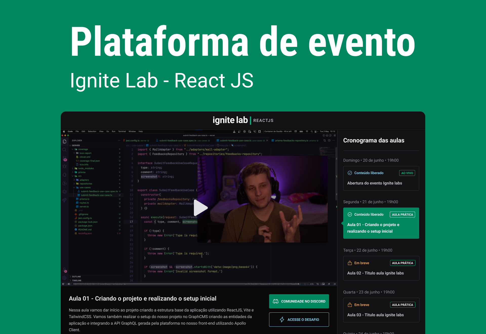

## ✨ Stack
-  [X] Typescript
-  [X] Headless CMS (Content Management System) com graphcms
-  [X] @apollo/client and Graphql
-  [X] svg2jsx para gerar um componente SVG (https://svg2jsx.com/)
-  [X] Phosphor icon family (https://phosphoricons.com/)

## 📌 News included in the project
-  [X] NextJS
-  [X] Chakra UI
-  [X] Next-Auth
-  [X] Login with **Github**
-  [X] Login with **Google**

## 🔖 Layout

Você pode visualizar o layout do projeto através [desse link](https://www.figma.com/community/file/1120711251998877938). É necessário ter conta no [Figma](http://figma.com/) para acessá-lo.

## Executando o projeto

Pelo seu terminal navegue até a pasta do projeto e execute:

```cl
  yarn
  yarn dev
```

Lembre-se de adicionar as Environment Variables no projeto:

```cl
  GITHUB_ID
  GITHUB_SECRET

  NEXTAUTH_URL
  NEXTAUTH_SECRET

  NEXT_PUBLIC_VITE_API_URL
  NEXT_PUBLIC_VITE_API_ACCESS_TOKEN
```

## Contato

Siga-me no Linkedin, estou sempre por lá.


